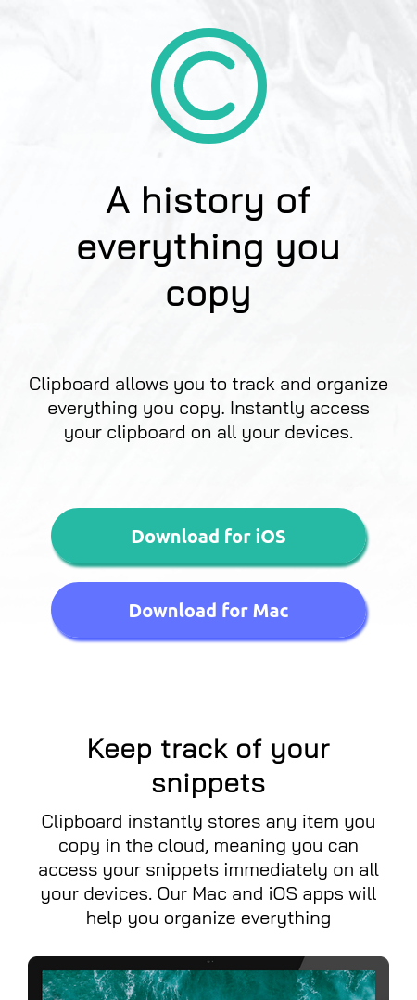

# Frontend Mentor - Clipboard landing page solution

This is a solution to the [Clipboard landing page challenge on Frontend Mentor](https://www.frontendmentor.io/challenges/clipboard-landing-page-5cc9bccd6c4c91111378ecb9). Frontend Mentor challenges help you improve your coding skills by building realistic projects. 

## Table of contents

- [Overview](#overview)
  - [Screenshot](#screenshot)
  - [Links](#links)
- [My process](#my-process)
  - [Built with](#built-with)
  - [What I learned](#what-i-learned)
- [Author](#author)
**Note: Delete this note and update the table of contents based on what sections you keep.**

## Overview
This was a pretty fair challenge and got me to learn one or two things, not only css but git and some other stuff as well.

### Screenshot



### Links

- Solution URL: [Add solution URL here](https://github.com/mukwende2000/clipboard)
- Live Site URL: [Add live site URL here](https://your-live-site-url.com)

## My process
I wanted to really give this project all i have and so i made sure i plan out every thing ahead,
when i was done with the planning, i created the necessary files and folders and immediatley initialized
a repo both locally and remote. I have learned that mobile first approach is always the best and so after
writing all the html (semantically ofcouse) immediately wrote the styles for the mobile view after which
i did the desktop, made as many(or as few) commit as necessay throughout the project.
### Built with

- Semantic HTML5 markup
- CSS custom properties
- Mobile-first workflow

### What I learned
Responsive design is my main aim at the moment, it is the reason i am doing an html and css only projects(otherwise i should be learning react and typescript now), so one of the few thing i learned was the max-width property to display an element at a fluid width until a certain limit is reached
this code may explain better than me
```css
.btns button {
    max-width: 340px;
    width: 100%;
    border: none;
    border-radius: 30px;
    height: 60px;
    margin: .5rem;
    color: #fff;
    font-size: 1rem;
    font-weight: bold;
    transition: opacity .4s;
}
```
I really enjoyed that part of the code because i have always known that responsiveness is not about media querries, where you need to change things at one breakpoint or another. when i tried to use the minmax function i.e
```css
.btns button {
  width: minmax(100%, 340px)
}
```
i  realised that the minmax is only used with grids which is something i didn't know.
I also had a chance to practice the css variables. Also learned some git although i wouldn't want get into all that.
overall this project taught me one or two things.

## Author

- Frontend Mentor - [@yourusername](https://www.frontendmentor.io/profile/mukwende2000)
- Twitter - [@yourusername](https://www.twitter.com/mukwende16)
